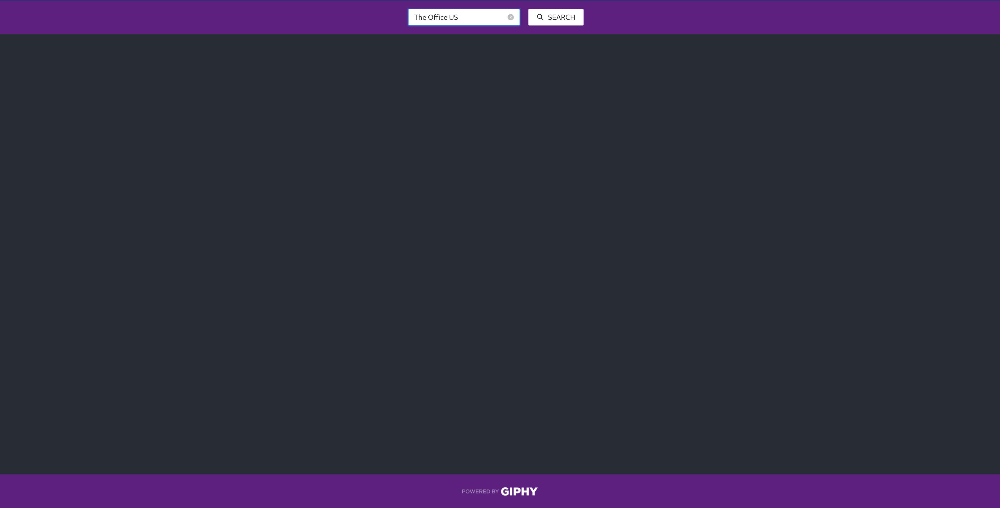

# Kaiphy

> A Single Page Application that accepts a search term through a form and displays GIFS based on the search term using the GIPHY API.

## Table of Contents

- [Kaiphy](#kaiphy)
  - [Table of Contents](#table-of-contents)
  - [General Information](#general-information)
  - [Technologies Used](#technologies-used)
  - [API](#api)
  - [Install](#install)
  - [Available Scripts](#available-scripts)
    - [`npm start`](#npm-start)
    - [`npm test`](#npm-test)
    - [`npm run build`](#npm-run-build)
    - [`npm run eject`](#npm-run-eject)
  - [Run with Docker](#run-with-docker)
  - [Features](#features)
  - [Screenshots](#screenshots)
  - [Room for Improvement](#room-for-improvement)
  - [License](#license)

## General Information

- This project was bootstrapped with [Create React App](https://github.com/facebook/create-react-app).

## Technologies Used

> - **node** - version 14.17.5 (https://nodejs.org/it/)
> - **Docker** - version 20.10.10 (https://www.docker.com/)
> - **typescript** - version 4.4.3 (https://github.com/microsoft/TypeScript)
> - **react** - version 17.0.2 (https://github.com/facebook/react)
> - **axios** - version 0.24.0 (https://npmjs.com/package/axios)
> - **antd** - version 4.16.13 (https://ant.design/)

## API

> - **GIPHY API** - (https://developers.giphy.com/docs/api/#quick-start-guide)

## Install

The complete list of dependencies is included in `./package-lock.json`.\
Run `npm install` to install all dependencies.

## Available Scripts

In the project directory, you can run:

### `npm start`

Runs the app in the development mode.\
Open [http://localhost:3000](http://localhost:3000) to view it in the browser.

The page will reload if you make edits.\
You will also see any lint errors in the console.

### `npm test`

Launches the test runner in the interactive watch mode.\
See the section about [running tests](https://facebook.github.io/create-react-app/docs/running-tests) for more information.

### `npm run build`

Builds the app for production to the `build` folder.\
It correctly bundles React in production mode and optimizes the build for the best performance.

The build is minified and the filenames include the hashes.\
Your app is ready to be deployed!

See the section about [deployment](https://facebook.github.io/create-react-app/docs/deployment) for more information.

### `npm run eject`

**Note: this is a one-way operation. Once you `eject`, you can’t go back!**

If you aren’t satisfied with the build tool and configuration choices, you can `eject` at any time. This command will remove the single build dependency from your project.

Instead, it will copy all the configuration files and the transitive dependencies (webpack, Babel, ESLint, etc) right into your project so you have full control over them. All of the commands except `eject` will still work, but they will point to the copied scripts so you can tweak them. At this point you’re on your own.

You don’t have to ever use `eject`. The curated feature set is suitable for small and middle deployments, and you shouldn’t feel obligated to use this feature. However we understand that this tool wouldn’t be useful if you couldn’t customize it when you are ready for it.

## Run with Docker

You can run `docker build -t kaiphy:latest .` to build the Docker image.
Then you can run `docker run --name kaiphy -d -p 3000:3000 kaiphy:latest` to build the container for the image; the application will be available on port 3000.
Other useful commands are:

- `docker stop kaiphy` to stop the containter;
- `docker start kaiphy` to start the containter;
- `docker ps` to check the status of the container.

## Features

> - Search for any GIF provided by GIPHY API by typing a keyword of your choice inside the form;
> - GIFs are rendered in a responsive manner;
> - In order to speed up the development process, no async-handler library (i.e. redux-thunk, reduz-saga) was added. The async logic is placed inside the Hooks, as per React's official docs;
> - The response data provided by GIPHY API is stored in the component's state. For the sake of the challenge and for the aforementioned point, no state management library was added.

## Screenshots

&nbsp;&nbsp;

## Room for Improvement

Done:

- [x] Dockerize the application;
- [x] Fix Docker instructions in README.md;
- [x] Currently the meta status related to the API call is not handled properly;
- [x] There seems to be a bug related to `process.env`. Needs further investigation, might be related to webpack;
  > - **UPDATE**:
        This bug is related to `create-react-app`. Basically hot reload works, but the aforementioned error comes up and the page becomes unresponsive, with manual refresh being the only solution.
        This happens because now CRA uses `react-error-overlay` in webpack.
        As a temporary fix suggested in this thread (https://github.com/facebook/create-react-app/issues/11771) on CRA GitHub's repository, `react-error-overlay@6.0.9` has been added among the dev-dependencies;
- [x] Find efficient way to handle meta status - i.e. show loading when API call is pending and error when it fails.
- [x] Implement Webpack config by adding base path;
- [x] Find more efficient solution to render GIFs in responsive manner;
- [x] Add debounce function when fetching GIFs.

Todo:

- [ ] Replace CSS files and inline styles with CSS modules;
- [ ] Keep current GIFs data on browser refresh;
- [ ] Install and configure `husky` for pre-commit checks (https://github.com/typicode/husky);
- [ ] Implement i18n.

Known bugs:

- [ ] When input field is empty, an API call with query as empty string is performed;
- [ ] Fix navbar responsive behavior for mobile.

## License

This project is distributed under Open Source license.
